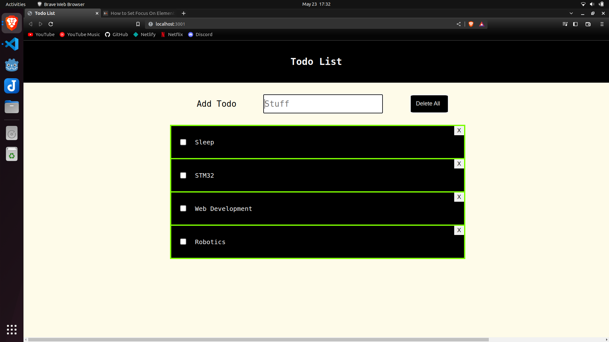

## Purpose

To learn and demonstrate React Hooks and Functional Components.

## Demo

<a href="https://todopolaris.netlify.app/">Todo App</a>

## Setup

- Install node.js, npm (if not existing already)
- `cd todo-react`
- `npm i`
- `npm start`
- Web App should be up and running at `localhost:3000`

## Done

- List Todo Items
- Add Todo Items
- Delete Todo Items
- Persistance of Todo Items
- Basic Styling
- Deployment
- Margins, Background Fixed
- Button Style Somewhat Fixed
- Delete All
- Max Length Fix for long sentences
- Checkbox
- Edit Todo (On Click change into input, change back after editing)

## TODO

### Functionality

- Search Functionality
- Priority Functionality

### Style

- Hover On Buttons
- Better Styling (Gradient,Shadow)

### Extra Feature

- Authentication

### Code Improvement

- useContext, useReducers for removing prop cascading
- Add unit tests
